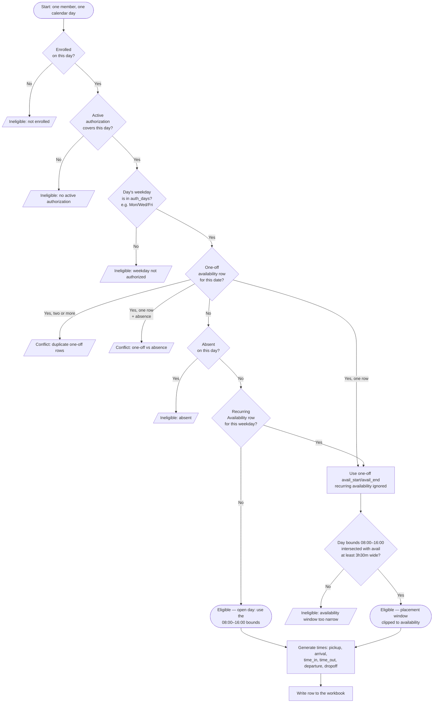

# How the Scheduler Decides to Schedule a Day

For every member in a run, the scheduler walks every day of the target
month and asks a series of questions. The first answer that says "no"
makes that day **ineligible** (blank cells in the workbook); only days
that pass every check get a generated set of times.

This page is the plain-English version of `compute_day_eligibility` in
`monthly_schedule/per_day.py` and `process_member` in
`new_monthly_schedule.py`.

## The flow

## What each check actually looks at

| # | Question | Data source | Code |
|---|---|---|---|
| 1 | Is the member enrolled on this date? | `Enrollment.start_date` ≤ day ≤ `Enrollment.end_date` (or open-ended) | `MemberContext.is_enrolled` |
| 2 | Is there an active authorization on this date? | `Authorization.effective_start` ≤ day ≤ `Authorization.effective_end` | `MemberContext.active_authorization` |
| 3 | Is the day's weekday in `auth_days`? | `Authorization.auth_days` (e.g. `"1,3,5"` = Mon/Wed/Fri) | `get_authorized_weekdays` |
| 4 | Is there a `OneOffAvailability` row for this exact date? | `OneOffAvailability.date == day` | `MemberContext.one_offs_for` |
| 5 | Is the member absent on this date? | Any `Absences.start_date` ≤ day ≤ `Absences.end_date` | `MemberContext.is_absent` |
| 6 | Is there a recurring `Availability` row for this weekday? | `Availability.day_of_week == day.isoweekday()` whose effective-date window includes the day | `MemberContext.availability_for` |
| 7 | Is the placement window wide enough for a session? | `min(latest_time_out, avail_end) − max(earliest_time_in, avail_start)` ≥ `session_length_min` (3h30m) | `compute_day_eligibility` |

## Whole-month early skip

Before walking days, `compute_month_failure` does three coarse checks
across the whole month. If any of them is true, the member is skipped
entirely and surfaces in `skipped_members_<YYYY-MM-DD>.csv`:

- **Not enrolled any day this month** → `"not enrolled during this month"`
- **No active authorization any day this month** → `"no active authorization for this month"`
- **Absent every authorized day this month** → `"absent for the entire month"`

## After eligibility passes

Once a day is eligible:

1. **Travel time.** `resolve_travel_minutes` either reuses a cached
   route (from `geo_cache.json`) or asks Google Routes for the drive
   time from the member's address to the configured destination.
2. **Time generation.** `build_daily_schedule` picks a random visit
   length (3h30m–4h00m, capped to the free time), then drops that block
   at a random position inside the placement window so the whole of it
   (Time-In → Time-Out) fits. Pickup / arrival / departure / dropoff are
   derived around it using the configurable buffer values in **Settings
   → Scheduling Rules**. Arrival never lands before the member's
   availability start by more than the small Time-In offset, and
   Time-In/Time-Out stay within the 08:00–16:00 day bounds.
3. **Time cache.** If a row for this `(center_id, date)` already exists
   in `time_cache.json`, the plan + travel match, and the cached block
   still fits the current placement window, the cached times are reused
   verbatim. This is what makes a partial-month rerun (May 1–19) produce
   the **same printed times** when the full month (May 1–31) is
   regenerated later.

## Why each check is in this order

The checks are ordered from **cheap to expensive** and from **member
absent to member partially constrained**:

1. Enrollment + authorization gate the entire month — failing here
   means we don't bother loading anything else.
2. Weekday in auth_days is a constant-time set lookup.
3. One-offs and absences come next because they can produce different
   surfaced reasons (silent skip vs. conflict in the failures CSV).
4. The placement-window check is last because it depends on the plan's
   day bounds and the chosen availability row.

If you turn on the **Debug** checkbox in the GUI, each authorized day
gets a row in `Debug_<YYYY-MM>.csv` recording which of these checks
made it ineligible (or `yes` if it was scheduled), along with the
availability used, absence/leave type, authorized weekdays, the
placement window, and the maximum session length that fit.
